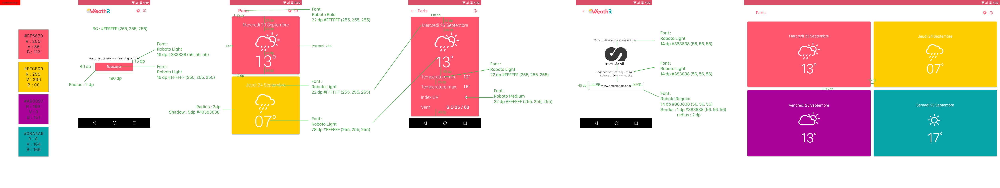

# weathR Android Kotlin - Test CDI

Voici les consignes pour le test technique Android, niveau CDI.

## Travail demandé

### Partie 1

L'objectif de cette première partie est de réaliser l'application weathR dont les captures d'écran sont disponibles dans le fichier [README.md](README.md) et dont les _guidelines_ sont les suivantes :

Voici quelques éléments supplémentaires pour vous aider :

* Ce test technique est a faire en Kotlin
* les couleurs de l'application et des cellules de la home page et de la page de détail sont disponibles dans le fichier _colors.xml_ ;
* toutes les images de l'application sont disponibles dans le dossier _drawable-xxxhdpi_ ;
* les éléments de la page _about_ sont disponibles dans le dossier _assets_ ;
* les chaînes de caractères de l'application sont disponibles dans le fichier _strings.xml_.

Voici quelques éléments supplémentaires concernant l'application :

* l'écran principal de l'application doit consommer et afficher les éléments du service web décrit plus haut dans cet énoncé ;
* depuis l'écran principal, il est possible d'ouvrir un pop-up permettant de choisir une ville et un nombre de jour en cliquant sur la roue
crantée ;
* depuis l'écran principal, il est possible d'ouvrir la page à propos en cliquant sur l'icône _information_ ;
* depuis l'écran principal, il est possible d'ouvrir le détail d'une journée en cliquant sur l'un des éléments de la liste ;
* autant que possible votre application devra gérer les erreurs liées à une mauvaise connectivité du terminal ou au parsing du fichier JSON ;
* la page principale devra s'afficher sur une seule colonne sur téléphone et tablette 7 pouces en portrait et sur deux colonnes dans les
autres cas (tablette 7 pouces paysage, tablette 10 pouces portrait et paysage).
* il convient de sauvegarder les choix de l'utilisateur entre deux sessions.

### Partie 2

#### Exercice 2.1

Actuellement, l'application est adapté pour les francophones. Il convient de mettre en place une solution permettant que le mot _city_ s'affiche à la place du mot
_ville_ dans le cas d'un terminal en langue anglaise.

#### Exercice 2.2

Actuellement, l'application ne géolocalise pas réellement l'utilisateur. Faites en sorte que l'écran principal de l'application géolocalise l'utilisateur.
Cette géolocalisation n'aura aucun impact sur le fonctionnel de l'application et les coordonnées de l'utilisateur pourront simplement être affichées
dans le logcat à travers une log de type _info_.
