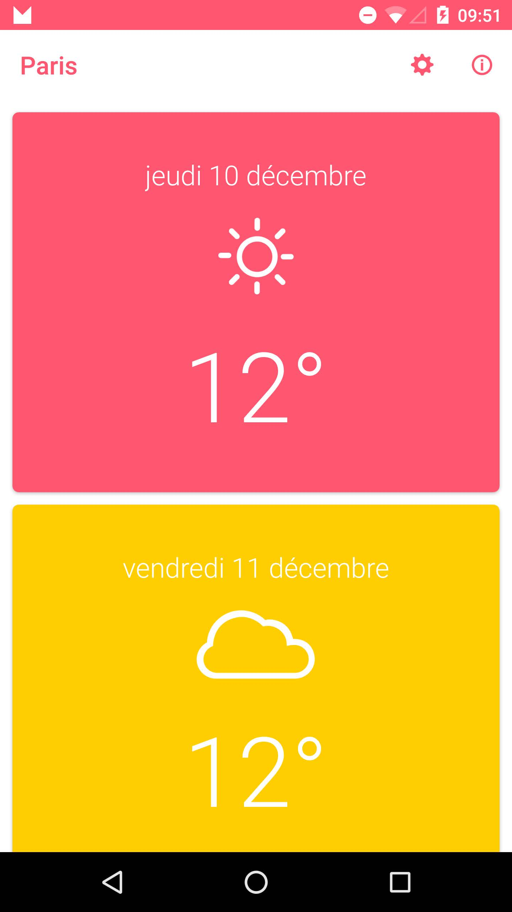
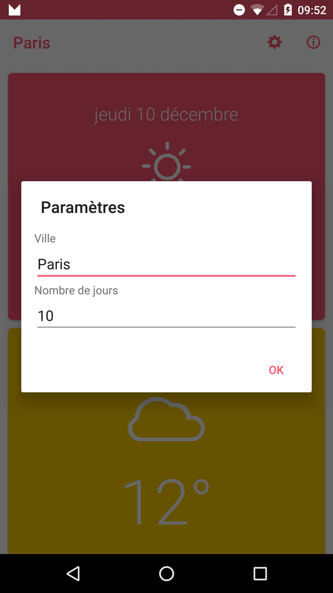
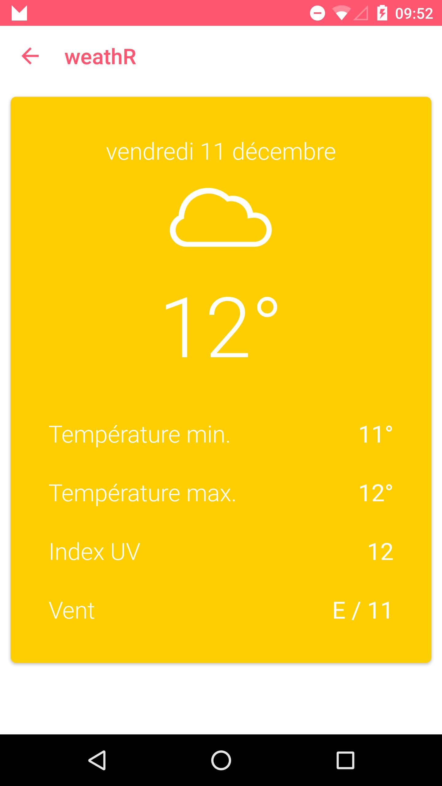

# weathR Android Kotlin - Test CDI

Vous vous apprêtez à effectuer un test technique créé par Smart&amp;Soft.

## Avant de commencer

Assurez-vous que votre environnement est à jour avec les versions suivantes :

* SDK Android avec les versions 28 des derniers outils (SDK API 28, Build Tools 28.0.0, Support Library 28.0.0, etc.) ;
* Android Studio v3.1.x ;

Pour aborder le test sereinement, il convient également d'avoir :

* un compte GitHub ;
* un outil vous permettant une interaction avec un dépôt git et notamment les actions suivantes : clonage d'un dépôt, création d'une branche, commit, push et création de tag ;
* une téléphone et une tablette (7 pouces ou plus) sous Android 4.0.3 ou plus, ou à défaut un émulateur.

## Consignes

En cliquant sur le bouton ci-dessous, vous découvrirez le lien d'un dépôt git hébergé sur GitHub et vous disposerez d'une heure pour effectuer le test.

Ce dépôt contient deux choses :

* le code source Kotlin d'une application Android développée sous Android Studio et qui vous servira de base pour effectuer ce test technique ;
* un fichier [INSTRUCTIONS.md](INSTRUCTIONS.md) qui contient les consignes de chacun des exercices qui vous seront demandés dans ce test technique.
* un fichier [COMMENTS.md](COMMENTS.md) dans lequel vous pourrez discuter de vos choix.

Cet entretien technique se composant de plusieurs questions / exercices, il convient donc de réaliser un seul commit par exercice afin de mettre en avant l'avancement du projet ainsi que le travail effectué en détail pour ceux-ci.

> Les exercices s'enchaînent de manière logique. Il convient donc, dans la mesure du possible, de les réaliser dans l'ordre dans lequel ils apparaissent dans les documents fournis.

Il existe une autre version en Java du test, vous pouvez nous le demander si vous changez d'avis.

## Présentation du projet

### Présentation fonctionnelle

weathR est une application simple permettant de connaître la météo fictive de trois grandes villes, à savoir Paris, Londres et Milan, sur les cinq à dix prochains jours.

Cette application se compose de 3 écrans :

* l'écran _home_ qui affiche sous la forme d'une liste les prévisions météo de la ville active ;
* l'écran _détail_ qui affiche de manière plus détaillée les prévisions météo d'une journée spécifique. On y accède en cliquant sur un item de la liste exposée par l'écran _home_ ;
* l'écran _about_, accessible depuis la barre d'action de la _home_, qui permet d'afficher quelques informations relatives à l'éditeur de l'application, à savoir Smart&amp;Soft.

Cette application se compose également d'un pop-up permettant de paramétrer la ville pour laquelle on souhaite connaitre la météo, ainsi que le nombre de jour à afficher (entre cinq et dix). Cette popup est accessible depuis la _home_ en cliquant sur la roue dentée depuis la barre d'action.

À noter que l'écran _home_ supporte une action de _swipe-to-refresh_ afin de forcer la refraîchissement de son contenu.

Les données de l'application sont récupérées depuis un service web.

### Maquettes

Pour mieux vous rendre compte du contenu de l'application, voici quelques captures d'écran :






### Présentation technique

#### Le service web

Comme précisé précédemment, les données permettant d'alimenter l'application sont issues d'un service web : [https://smartnsoft.com/shared/weather/index.php?city={city}&forecasts={forecasts}](https://smartnsoft.com/shared/weather/index.php?city=paris&forecasts=10).

Voici un example d'appel et du JSON retourné :

```
{
  "code": 200,
  "message": "OK",
  "city": "paris",
  "forecasts": [
    {
      "date": "2017-03-22",
      "temperatureMin": 3,
      "temperatureMax": 22,
      "type": "RAINY",
      "uvIndex": 3,
      "windDirection": "NE",
      "windSpeed": 22
    },
    {
      "date": "2017-03-23",
      "temperatureMin": 3,
      "temperatureMax": 23,
      "type": "SNOWY",
      "uvIndex": 3,
      "windDirection": "SE",
      "windSpeed": 23
    },
    {
      "date": "2017-03-24",
      "temperatureMin": 3,
      "temperatureMax": 24,
      "type": "STORMY",
      "uvIndex": 3,
      "windDirection": "N",
      "windSpeed": 24
    },
    {
      "date": "2017-03-25",
      "temperatureMin": 3,
      "temperatureMax": 25,
      "type": "SUNNY",
      "uvIndex": 3,
      "windDirection": "S",
      "windSpeed": 25
    },
    {
      "date": "2017-03-26",
      "temperatureMin": 3,
      "temperatureMax": 26,
      "type": "CLOUDY",
      "uvIndex": 3,
      "windDirection": "W",
      "windSpeed": 26
    },
    {
      "date": "2017-03-27",
      "temperatureMin": 3,
      "temperatureMax": 27,
      "type": "RAINY",
      "uvIndex": 3,
      "windDirection": "E",
      "windSpeed": 27
    },
    {
      "date": "2017-03-28",
      "temperatureMin": 3,
      "temperatureMax": 28,
      "type": "SNOWY",
      "uvIndex": 3,
      "windDirection": "NW",
      "windSpeed": 28
    },
    {
      "date": "2017-03-29",
      "temperatureMin": 3,
      "temperatureMax": 29,
      "type": "STORMY",
      "uvIndex": 3,
      "windDirection": "SW",
      "windSpeed": 29
    },
    {
      "date": "2017-03-30",
      "temperatureMin": 3,
      "temperatureMax": 30,
      "type": "SUNNY",
      "uvIndex": 3,
      "windDirection": "NE",
      "windSpeed": 30
    },
    {
      "date": "2017-03-31",
      "temperatureMin": 3,
      "temperatureMax": 31,
      "type": "CLOUDY",
      "uvIndex": 3,
      "windDirection": "SE",
      "windSpeed": 31
    }
  ]
}
```

#### Architecture de l'application Android

Le projet weathR est un projet Android Studio ne contenant qu'un seul module, nommé __app__ et correspondant à l'application Android.

En l'état actuel, le projet contient uniquement une activité et un fragment pour la page _about_ et les _assets_ et _resources_ nécessaires.
